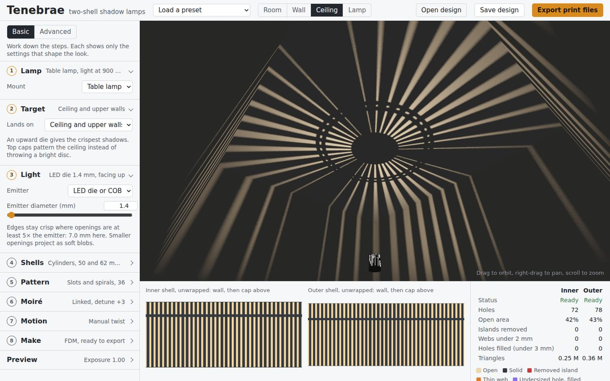

# Tenebrae

A single-file browser studio for designing **two-shell perforated shadow lamps**: nested cylinders or spheres, turning around one LED, that project moiré patterns onto the ceiling and walls. It exports watertight STLs ready to print.

*Tenebrae* is Latin for "darkness" or "shadows". It is also the name of a Holy Week service in which candles are put out one by one until the church is dark. These lamps work the same way: the pattern you see is made by the light the shells block.

**[Open the studio](https://knnurl.github.io/tenebrae-studio/)**

**[Read the tutorial](https://knnurl.github.io/tenebrae-studio/tutorial.html)**



Light reaches the room only where both shells are open along the ray from the LED, so the room sees the product of two masks. Detune the outer shell's count against the inner one and the room shows travelling moiré lobes; twist one shell by a few degrees and they sweep all the way round.

---

## Features

**Guided design**
- Sidebar in decision order: Lamp, Target, Light, Shells, Pattern, Moiré, Motion, Make. Each step's header shows its current choice.
- Basic level shows the 23 controls that shape the look; Advanced shows all of them.
- Decisions set their knock-on settings and say so: choosing a target sets the emitter direction and caps; choosing a mount sets the light height.
- The outer shell can be fitted automatically from the inner shell and one gap, around the wall and above the cap.

**Pattern engine**
- Five generators: slots and spirals, rings and waves (with bridges), phyllotaxis dots, Voronoi cells, superformula lattice.
- Linked mode copies the inner pattern to the outer shell with a count detune, and optional mirror.
- Patterned flat caps at the top, the bottom or both. A cap can continue the wall pattern (spokes line up with slots, dots keep their spacing) or carry its own.
- Stem bores through the caps on the stem side, set by the mount. The inner bore passes the LED board; the outer bore turns on the stem as a plain bearing.
- An outer shell capped at both ends is split at the light's plane into two halves that close around the inner shell, or, for cylinders, its caps export as separate flat discs instead, with no split.
- Randomize with per-slider locks and undo. It keeps the first of up to ten variations that passes the print checks.
- Fourteen presets, grouped into pendants, table uplights, other targets and studies. The studio opens on the mirrored-spiral pendant.

**Room preview**
- WebGL2 ray test through all four shell faces and every cap, per pixel.
- Emitter models: ideal point, LED die, filament, frosted bulb, facing all round, up or down. Soft shadows refine progressively.
- Room, wall, ceiling and lamp views, with orbit, pan and zoom. The view re-frames when the lamp or room changes.

**Motion**
- Manual twist with bookmarks and the twist period after which the look repeats.
- Motor mode with per-shell rpm and the resulting speed of the room pattern.

**Fabrication checks**
- Holes cut along rays from the light centre, so wall thickness never narrows the beam.
- Islands with no path to a rim are removed. A pattern that cuts a shell into rings is blocked.
- Thin webs found by morphological opening; holes too small to print anywhere are filled.
- FDM overhangs on cylinder walls: hole edges facing the bed flatter than 45°, in runs too wide to bridge, with the bed end taken cap-down. Twisted slots lean at atan(1 / twist) at lamp height, so keep the twist at or below 1.00 to print without supports.
- Clearance between shells, radially and between caps; the emitter must fit inside the inner shell.
- FDM and SLS profiles. Spheres can be split at the equator with a solid seam band.

**Export** (dropdown in the header)
- **Format:** *3D print (STL)* or *Laser cut (SVG, DXF)*.
- **Shells:** both, inner only or outer only.
- **Caps:** attached to the walls, separate parts, or left out.
- **3D print** gives one STL per shell, half or part, each checked edge-manifold with genus matching its hole count, plus `design.json`, `interface.json` for CAD, `profile.json` with the Fusion proxy script, and `checks.txt`.
- **Laser cut** opens each cylinder wall into a flat rectangle at mid-thickness, with caps as cut discs or as STLs to print. Each flat part comes as SVG and DXF R12 in millimetres: red holes cut first, blue outlines last.
  - **Kerf:** holes are traced half a kerf inside, through the distance field, and outlines grown half a kerf, so parts cut to size.
  - **Seam backing strip:** an optional strip glued inside the seam carries the same holes, mapped to its smaller radius, so it blocks no light.
  - **Cap joint:**
    - *Tabs into slots* (default): the wall's capped ends carry tabs that push through arc slots in the cap, and the extra folds flat over the cap. Slots cut to sheet thickness plus clearance. The cap's flange reaches past the wall, so the wall pattern stops where rays clear it, keeping the preview exact.
    - *Printed caps*: each cap comes as an STL with a groove on its inside face; the rolled wall's end pushes into it and the groove holds the tube round. The groove is sheet thickness plus clearance across (0.1 mm per side by default), 5 mm deep, with a lead-in chamfer at the mouth. The cap's plate is thickened away from the light along the rays (2.4 mm by default), so it blocks no more light than the thin disc in the preview. The wall pattern stops where rays clear the outer lip, and the cap pattern starts inside the inner lip. Print caps flat face down, with no supports.
    - *Press-fit inside*: plain discs that press into the tube ends.
  - **Sheet thickness** sets the wall thickness of both shells; the menu warns when the sheet is too thick to roll to the radius.
  - SVGs print at 1:1 for a card test.
- **Save preview image (PNG)** saves the current view.

---

## Usage

No server and no install at runtime.

```
open index.html
```

Or serve locally if your browser restricts local files:

```bash
python3 -m http.server 8080
# then open http://localhost:8080/
```

The [tutorial](tutorial.html) walks one lamp from the first decision to print files.

---

## Workflow

1. **Lamp:** table lamp or pendant.
2. **Target:** where the pattern lands. This sets which way the emitter faces and whether the shells get top caps.
3. **Light:** emitter type and size. The note gives the smallest opening that stays crisp.
4. **Shells:** inner shape, radius and height; leave the outer shell auto-fitted with a 9 mm gap.
5. **Pattern:** generator and its main sliders. Randomize with locks to explore.
6. **Moiré:** detune the outer shell by 2 or 3 for broad lobes, or pair an independent pattern.
7. **Motion:** manual twist for a hand-turned lamp; bookmark the looks you like.
8. **Make:** FDM, SLS or laser-cut sheet, check the status line, then **Export**: 3D print or laser cut, which shells, and caps attached, separate or left out.

---

## Export format

```
inner-shell.stl     one watertight part (lower/upper halves when split;
                    -wall, -top-cap and -bottom-cap when caps are separate)
outer-shell.stl
design.json         reopen with Open design
interface.json      end diameters, cap planes, hub and bore radii, stem side, closest gap,
                    required clearance, twist periods, bookmarks
checks.txt          triangle counts, watertight results, hole and web counts, notes
profile.json        one closed (r, z) outline per part, revolved about z: the blank shell for CAD
fusion/tenebrae_proxies/
                    Fusion script that reads profile.json and builds one solid body per part
```

### Mating parts in Fusion

Don't convert the patterned STLs to bodies: at hundreds of thousands of triangles the conversion is slow and the result has one face per triangle. Instead:

1. **Utilities > Add-Ins > Scripts and Add-Ins**, click **+** next to *My Scripts*, and pick the `fusion/tenebrae_proxies` folder from the export.
2. Run **tenebrae_proxies** and choose `profile.json`. It adds a *Tenebrae proxies* component with one body per part, named like the STLs, and reports each body's volume against the profile.
3. Design stems, spiders, clips and hubs against these bodies. Insert the patterned STL as a mesh only to check the look.

The shell axis is model Z with the light centre at the origin; in a Y-up design the lamp lies on its side. Each body's sketch stays in the timeline, so dimensions can be checked there. The proxies leave out the pattern and the one-grid-cell chamfer where a wall meets a cap.

Units are millimetres, with the light centre at the origin and z up. Binary STL runs about 50 MB per million triangles; the table-uplight preset is about 0.73 M triangles (roughly 36 MB) for both shells at the 0.7 mm grid.

---

## File structure

```
index.html            the studio: built, self-contained, no runtime dependencies
tutorial.html         the tutorial page
src/
  core.js             pattern generators, shell masks, constraints, mesher, STL and zip writers
  state.js            defaults, presets, auto-fit, design loading
  render.js           WebGL2 room and lamp renderer
  ui.js               sidebar, checks, camera, randomize, export
  template.html       page shell and styles
  tutorial.html       tutorial source ({{TOOL}} is replaced at build time)
  fusion/             Fusion script and manifest, inlined into index.html at build time
tools/
  build.js            builds index.html and tutorial.html from src/
  test.js             geometry test harness
docs/img/             screenshots
.github/workflows/
  pages.yml           tests, checks index.html is up to date, deploys to GitHub Pages
```

`index.html` is monolithic on purpose, so it can be dropped anywhere and opened directly. Edit `src/`, then rebuild.

---

## Development

```bash
node tools/build.js   # writes index.html and tutorial.html
node tools/test.js    # exits non-zero on any failure
```

The harness builds every preset's shells, whole and split, and checks that each mesh is edge-manifold with genus equal to (open ends − 1) + holes. It also checks volumes against analytic values for blank shells, ray alignment of hole walls, cap planes, clearance and collision detection, auto-fit gaps, twist periods, STL size and the zip structure.

For headless screenshots, `index.html?frames=N` caps soft-shadow refinement at N frames.

---

## Fabrication notes

- **Print coupons first:** flat plates 3 and 4 mm thick with 2–10 mm slot and hole ladders, lit by the real LED. They settle the true blur, which holes survive and how much the material leaks.
- **Crispness:** keep openings at least 5× the emitter. On the table-uplight preset's shells, 20–24 slots give crisp rays with a 1.4 mm die; its 36 slots give softer, finer rays.
- **Material:** matte black PETG or ASA. PLA softens around 60 °C, and light colours glow.
- **Laser cuts straight through:** holes in a sheet have walls square to it, not along the rays. Light arriving at elevation ψ loses about t × tan ψ of opening, which is 1.4 mm at 60° on 0.8 mm sheet; the preview models ray-aligned holes, so thinner sheet stays closer to it.
- **Laser instead of FDM for twisted walls:** steeply twisted slots (twist above about 0.8) overhang past what FDM can bridge and fail as spaghetti. Laser-cut walls avoid the problem entirely; use 0.5–1 mm polypropylene or black card and the laser-cut sheet profile.
- **FDM:** print capped cylinders cap-down; no supports needed. With separate caps, print the wall tubes upright and the cap discs flat; the discs sit on the tube ends at the joint planes listed in `interface.json`. Slots on vertical walls print cleanly. Rings and dots leave overhanging hole tops (no teardrop shaping yet). Split spheres throw a dark ring from the seam band; spheres suit SLS better.
- **Light:** Luminus SST-20 2700K CRI 95 on a 10 mm copper board, on an aluminium stem at the shell centre (±3 mm). Mean Well LDD-700L at 350–700 mA from a certified 24 V adapter, dimmed with its analogue input to avoid PWM flicker on moving shadows.
- **Twist:** run the outer shell's bottom rim on a printed V-groove race with 6 mm BBs, with felt drag. Put rim ticks at quarters of the twist period shown in the Motion step.

## Known limits

- Open ends throw bright discs; solid cap hubs leave a dark spot above and below the lamp.
- The preview shows direct light only; use ambient fill to approximate room bounce.
- Hole walls aren't drawn in the lamp close-up. The room projection is exact.
- The wall-to-cap corner has a chamfer of up to one grid cell.

---

## License

MIT. See [LICENSE](LICENSE).
